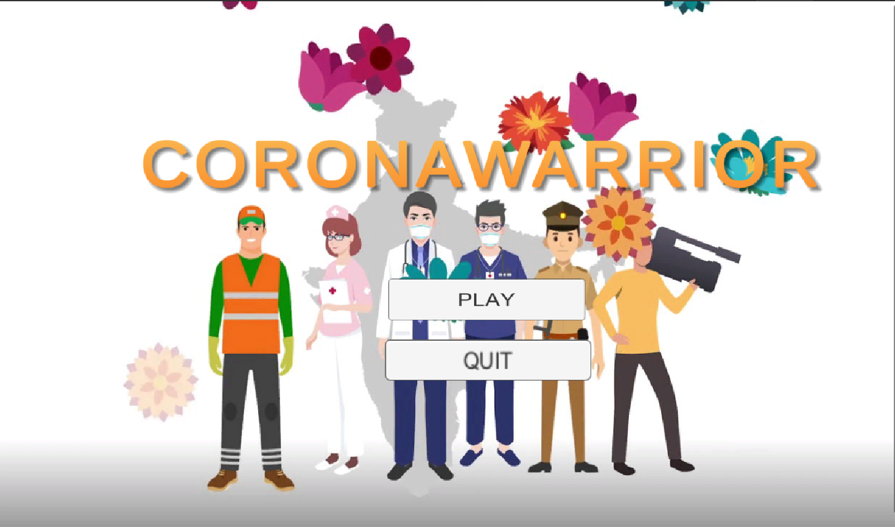

# CORONAWARRIOR

## INTRO
You are the frontline warrior with the mission to kill all the Corona virus ( AKA Covid-19).It is a Contagious disease which has affected whole world, every one is affected by it . the human family is suffering under an almost intolerable burden of loss. The climbing death toll is staggering, and we must work together to slow the spread of this virus. That is why you have been summoned to kill the virus with the vaccine . You must maintain social distance, if you come closer they will chase you  till you are affected. So get your masks on , put some sanitizers and get on the field. A tribute to Coronawarrior, who selflessly choose to put their lives at risk, their families remain at home living their lives in doubt and fear

## Software prerequisites:
1. Unity Hub
2. Unity3d 2020.3.5 or above
3. Visual Studio installed

## How to run the game
* clone this repository
* open the cloned repository with UnityHub by clicking add in unity hub and opening the clone repository
* To build the game simple go to file -> build settings -> build and run (make sure the build is on pc-standalone or webGL)
* Select the folder to build the game and wait for the build process to complete.
* Now play the game in your local computer

## Play the game on WEB
You can Play the GAME . By following this [link](https://animeshk-09.github.io/CORONAWARRIOR/)

